# HARDAX v1.1.0

<p align="center">
  
  
  
  
  
</p>

<p align="center">
  <b>Hardening Audit eXaminer for Android-based Devices</b><br>
  <i>Comprehensive Security Configuration Auditor for IoT & POS Terminals</i>
</p>

```
┏━━━━━━━━━━━━━━━━━━━━━━━━━━━━━━━━━━━━━━━━━━━━━━━━━━━━┓
┃  ██╗  ██╗ █████╗ ██████╗ ██████╗  █████╗ ██╗  ██╗  ┃
┃  ██║  ██║██╔══██╗██╔══██╗██╔══██╗██╔══██╗╚██╗██╔╝  ┃
┃  ███████║███████║██████╔╝██║  ██║███████║ ╚███╔╝   ┃
┃  ██╔══██║██╔══██║██╔══██╗██║  ██║██╔══██║ ██╔██    ┃
┃  ██║  ██║██║  ██║██║  ██║██████╔╝██║  ██║██╔╝ ██╗  ┃
┃  ╚═╝  ╚═╝╚═╝  ╚═╝╚═╝  ╚═╝╚═════╝ ╚═╝  ╚═╝╚═╝  ╚═╝  ┃
┃  [423 Checks] [14 Categories] [3 Report Formats]   ┃
┗━━━━━━━━━━━━━━━━━━━━━━━━━━━━━━━━━━━━━━━━━━━━━━━━━━━━┛
```

---

## 📋 Table of Contents

- [Overview](#-overview)
- [Features](#-features)
- [Supported Devices](#-supported-devices)
- [Installation](#-installation)
- [Usage](#-usage)
- [Security Categories](#-security-categories)
- [Status Levels](#-status-levels)
- [Report Formats](#-report-formats)
- [Tool Flow](#-tool-flow)
- [Extending HARDAX](#-extending-hardax)
- [Future Roadmap](#-future-roadmap)

---

## 🛡 Overview

**HARDAX** (Hardening Audit eXaminer) is a comprehensive security configuration auditor for Android-based devices. It performs 428 security checks across 15 categories to identify misconfigurations, vulnerabilities, and security weaknesses.

HARDAX is designed for:
- **Security Researchers** - Penetration testing and vulnerability assessment
- **IoT Security Teams** - Auditing Android-based IoT devices
- **POS Security Auditors** - PCI-DSS compliance verification for payment terminals
- **Enterprise Security** - MDM compliance verification
- **Developers** - Pre-release security validation

---

##  Features

| Feature | Description |
|---------|-------------|
| **428 Security Checks** | Comprehensive coverage across 15 security categories |
| **POS/Payment Terminal Support** | 28 PCI-DSS focused checks for payment devices |
| **No Root Required** | Runs entirely via ADB shell commands |
| **Dual Connection Modes** | ADB (USB) and SSH (Network) support |
| **5 Status Levels** | SAFE, WARNING, CRITICAL, VERIFY, INFO |
| **3 Report Formats** | TXT, CSV, HTML with interactive dashboard |
| **False Positive Prevention** | Smart null/empty handling with VERIFY status |
| **Extensible JSON Checks** | Easy to add custom security checks |
| **Beautiful CLI Output** | Color-coded real-time progress display |
| **Device Info Collection** | Automatic device fingerprinting |

---

## Supported Devices

HARDAX works with any Android-based device accessible via ADB or SSH:

| Device Type | Examples |
|-------------|----------|
| **POS Terminals** | PAX, Verifone, Ingenico, Sunmi, Newland, Clover, Square |
| **Smartphones & Tablets** | Samsung, Pixel, OnePlus, Xiaomi, etc. |
| **IoT Devices** | Android Things, AOSP-based smart devices |
| **Android Automotive** | Infotainment systems, head units |
| **Medical Devices** | Android-based clinical devices |
| **Industrial Android** | Rugged tablets, handheld scanners |
| **Android TV** | Smart TVs, set-top boxes |
| **Wearables** | Wear OS devices |

---

##  Installation


### Prerequisites

- Python 3.6 or higher
- ADB (Android Debug Bridge) installed and in PATH
- USB Debugging enabled on target device

### Quick Start

```bash
# Clone the repository
git clone https://github.com/iotsrg/hardax.git
cd hardax

# Connect your device via USB
adb devices

# Run HARDAX
python3 hardax.py
```

### For SSH Mode (Optional)

```bash
pip install paramiko
```

---

## 📖 Usage

### Basic Usage (ADB)

```bash
# Auto-detect connected device
python3 hardax.py

# Show commands being executed
python3 hardax.py --show-commands


# Specify device by serial
python3 hardax.py --serial DEVICE_SERIAL

# To run all commands run by default
python3 hardax.py --json-dir commands/

# Custom output directory
python3 hardax.py --out ./my_reports
```

### SSH Mode (Network)

```bash
python3 hardax.py --mode ssh --host 192.168.1.100 --ssh-user root --ssh-pass password
```

### All Options

```
usage: hardax.py [OPTIONS]

Options:
  --version             Show version
  --mode {adb,ssh}      Connection mode (default: adb)
  --serial SERIAL       ADB device serial number
  --host HOST           SSH hostname/IP
  --port PORT           SSH port (default: 22)
  --ssh-user USER       SSH username
  --ssh-pass PASS       SSH password
  --json FILE           Path to single JSON checks file
  --json-dir DIR        Directory with JSON check files
  --out DIR             Output directory (default: hardax_output)
  --progress-numbers    Show numeric progress counter
  --show-commands       Display each command being executed
```

---


## Security Categories

HARDAX organizes 428 checks into 15 security categories:

| Category | Checks | Description |
|----------|--------|-------------|
| **SYSTEM** | 97 | Kernel, memory, TEE, time, power, build properties, CIS benchmarks |
| **NETWORK** | 70 | Ports, WiFi, cellular, VPN, MQTT, CoAP, CAN bus, HL7, DICOM |
| **PRIVACY** | 52 | Biometrics, screen lock, location, sensors, clipboard, audio |
| **APPS** | 48 | Permissions, runtime, installation, dangerous permissions |
| **BLUETOOTH** | 29 | BLE/Classic security, pairing modes, profiles, MAC randomization |
| **POS_SECURITY** | 28 | PCI-DSS compliance, payment apps, kiosk mode, RAM scraper detection |
| **BOOT_SECURITY** | 21 | Verified boot, AVB, dm-verity, bootloader, integrity |
| **STORAGE** | 21 | Filesystem, backup, encryption, partitions |
| **DEVICE_MANAGEMENT** | 14 | MDM, accounts, developer options |
| **USB_SECURITY** | 14 | USB debugging, interfaces, serial ports, gadget mode |
| **CRYPTOGRAPHY** | 12 | Encryption, keys, credentials, API keys, certificates |
| **INPUT** | 9 | Keyboards, accessibility, input methods |
| **MALWARE** | 5 | Root detection, Frida, suspicious files |
| **ADB_SECURITY** | 4 | ADB keys, network ADB, debugging |
| **NFC_SECURITY** | 4 | NFC, Android Beam, tap-to-pay |

---

## Status Levels

HARDAX classifies findings into 5 status levels:

| Status | Color | Symbol | Description |
|--------|-------|--------|-------------|
| **SAFE** | 🟢 Green | ✓ | Secure configuration detected |
| **WARNING** | 🟡 Yellow | ⚠ | Potential risk - review recommended |
| **CRITICAL** | 🔴 Red | ✗ | Security issue - immediate action required |
| **VERIFY** | 🟣 Purple | ? | Manual verification required (null/empty output) |
| **INFO** | 🔵 Blue | ℹ | Informational - no action needed |


---

##  Tool Flow

```mermaid
flowchart TD
    A([Start HARDAX]) --> B{Mode?}
    B -->|ADB| C[USB Connection]
    B -->|SSH| D[Network Connection]
    C --> E[Detect Device]
    D --> E
    E --> F{Found?}
    F -->|No| G([Exit])
    F -->|Yes| H[Get Device Info]
    H --> I[Load 14 JSON Files]
    I --> J[423 Security Checks]
    J --> K[For Each Check]
    K --> L[Run Command]
    L --> M[Capture Output]
    M --> N{Evaluate}
    N -->|Empty + safe| O[✅ SAFE]
    N -->|Match pattern| O
    N -->|Null value| P[🟣 VERIFY]
    N -->|No match| Q{Level?}
    Q -->|critical| R[🔴 CRITICAL]
    Q -->|warning| S[🟡 WARNING]
    Q -->|info| T[🔵 INFO]
    O & P & R & S & T --> U[Store Result]
    U --> V{More?}
    V -->|Yes| K
    V -->|No| W[Generate Reports]
    W --> X[TXT + CSV + HTML]
    X --> Y([Done])
```



---


### Adding Custom Checks

Create or modify JSON files in the `commands/` directory:

```json
{
  "checks": [
    {
      "category": "NETWORK",
      "label": "Custom Port Check",
      "command": "netstat -tlnp 2>/dev/null | grep ':8080'",
      "safe_pattern": "^$",
      "level": "warning",
      "description": "Check if port 8080 is open",
      "empty_is_safe": true
    }
  ]
}
```

---

##  Future Roadmap

- [ ] `--category` flag to run specific categories
- [ ] `--severity` flag to filter by level
- [ ] `--format json` for JSON output
- [ ] Exit codes for CI/CD integration
- [ ] Save baseline configuration
- [ ] Diff reports between scans
- [ ] Device profiles (IoT/Automotive/Medical presets)
- [ ] CIS Android Benchmark mapping
- [ ] OWASP MASVS/MSTG mapping
- [ ] NIST guidelines mapping
- [ ] Remediation suggestions
- [ ] Multi-device parallel scanning
- [ ] Web dashboard (Flask/FastAPI)
- [ ] Plugin architecture
- [ ] APK analysis integration
- [ ] Firmware extraction support
